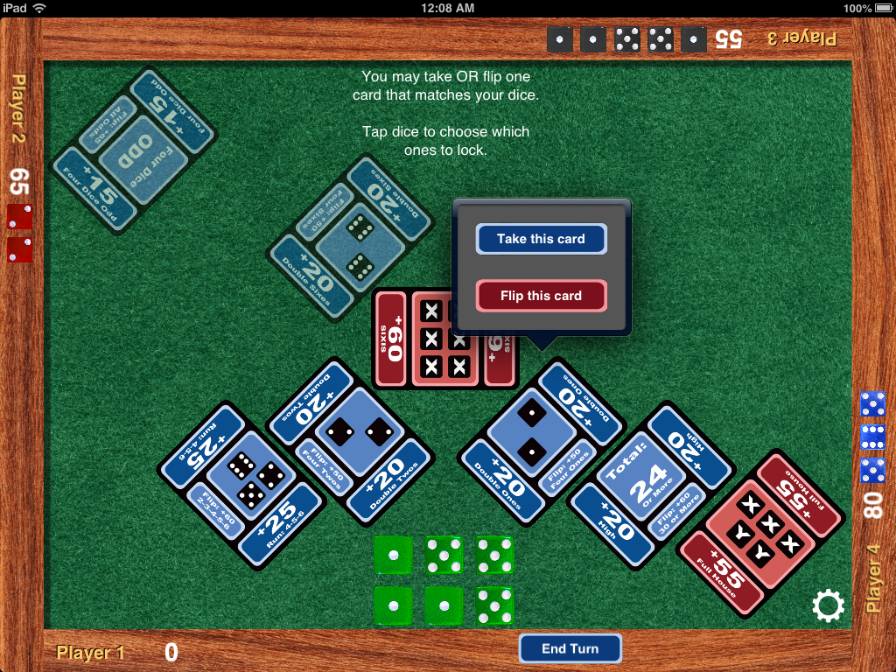

# Sixis (iPad edition)

This repository contains the source code and other resources for [Jason McIntosh](http://jmac.org)'s iOS adaptation of _Sixis_, a tabletop game designed by Chris Cieslik and published by [Asmadi Games](http://www.asmadigames.com).

## About Sixis

Sixis is a simple two- to four-player "press your luck" game where players try to roll and arrange dice to match point-scoring patterns displayed on cards. Players can make simple strategic decisions to "lock" dice or raise the stakes of certain cards, with the risk that their opponents might sneak in and claim those cards first.

This iOS edition takes a simulationist approach to play, directing the players to sit around an iPad, which it then treats as a little felt-covered tabletop -- complete with a tasteful wooden border that keeps the realistic-looking dice tidy. You can read [an essay by the author about his design approach](http://gameshelf.jmac.org/2012/11/announcing-sixis-for-ipad/).

The author sold iOS Sixis in the App Store for four years, from 2012 through 2016, through an agreement with Asmadi Games. With that publisher's permission, he makes its source code available in the interest of spirit of sharing, even though he retains ownership of it (see below).

## Contents

* **README.md** You're reading it.

* **LICENSE.md** Legal information, including usage permissions granted (and withheld). Please read this file too if you plan on studying the contents of this repository at all.

* **Notes and documents** contains design documents and sketches drafted in the early stages of this adaptation's creation.

* **Screenshots** contains a few iPad screenshots of the game in action.

* **Sixis** contains all the source code, sounds, images, and other resources necessary to build the game with XCode. `Sixis.xcodeproj` is the main XCode file.
